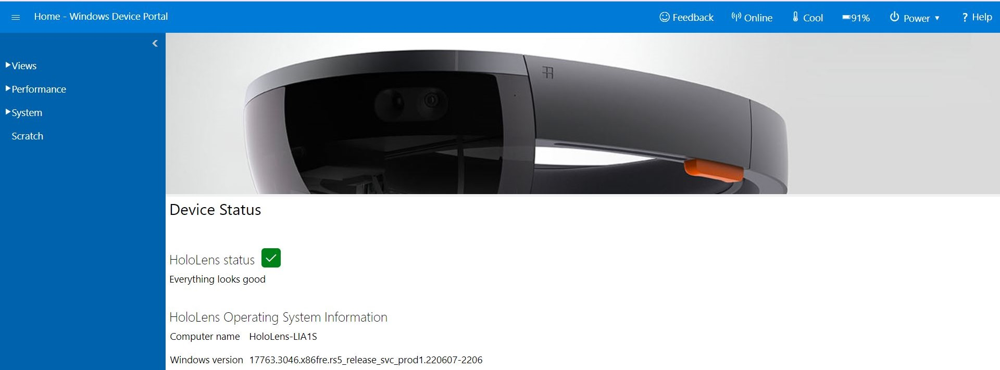
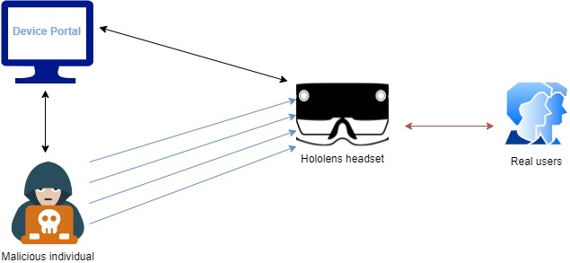
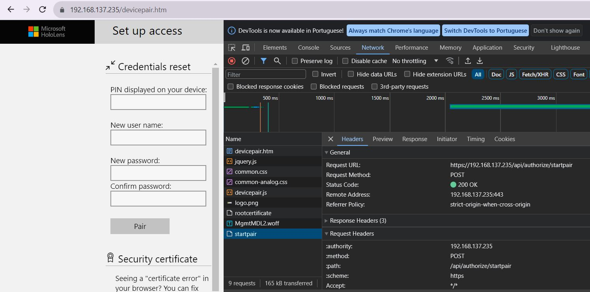
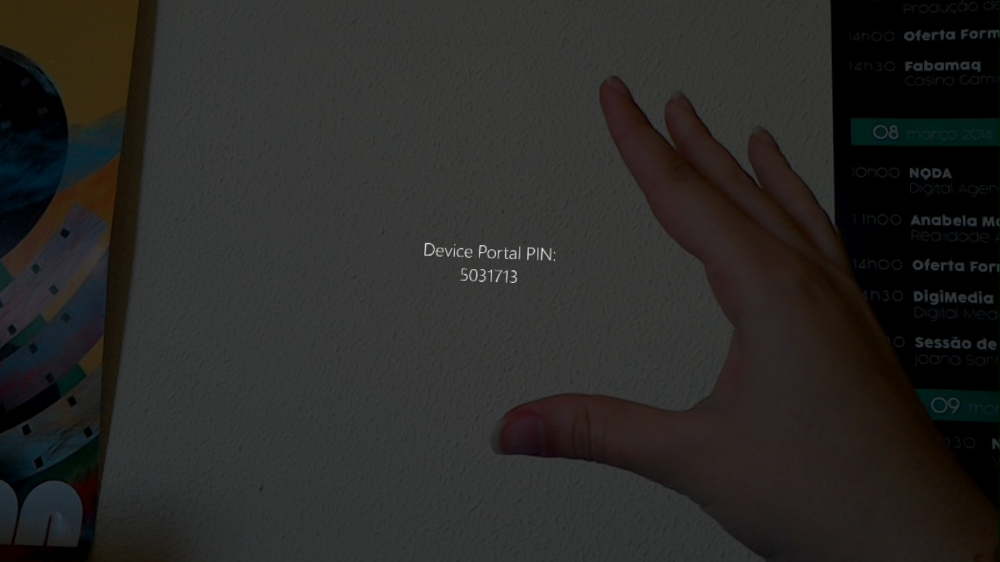
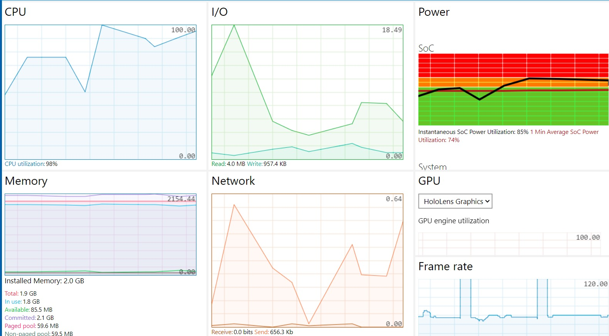

# Denial of Service on HoloLens via Device Portal functionalities

A Denial of Service (DoS) attack aims to overload a target system in such a way that it gradually becomes unable to respond to all the requests sent to it. This way, a legitimate user loses access to a service, which, depending on the application domain, can be crucial to their process. For this issue, we analyzed the HoloLens headsets that provide a Mixed Reality (MR)
experience. The HoloLens 1 and 2 provide a framework to manage and manipulate the content and functionalities on the HoloLens remotely. The tool is called the ”Device Portal,” as shown in Figure 1.1, and allows the user to manage applications, documents, and multimedia content stored on the head-mounted device. This tool also enables realtime visualization of the user’s activities on the device and immediate recording or screen capturing. Additionally, this tool enables the monitoring of system components, as well as managing processes that are running at the moment on the system.  

# Figure 1.1: HoloLens Device Portal

# Attack architecture
In Figure 1.2, the architecture of the performed attack is depicted. To carry out the attack, the malicious individual needs to be connected to the same network as the target. This connection enables the hacker to use a security scanner to analyze the entire network with the intention of identifying the devices available on the network.

Any device connected to the network can access the ”Device Portal” by simply entering the corresponding HoloLens IP in a browser. From the information gathered by the scanner, the attacker can identify the IP and use it to attempt to access the remote management service. By analyzing the network traffic when an action is performed on the ”Device Portal”, the hacker gains access to the requests made to the device’s API. With
this information, they can develop a script to run these requests to the API consecutively. Upon receiving all these requests, the CPU becomes overloaded, and consequently, the system becomes unresponsive to the commands of legitimate users, blocking the use of the HoloLens. Even if the user decides to restart the headsets, the attack continues as long as the IP remains unchanged or the attacker decides to stop it.  

# Figure 1.2: HoloLens DoS attack architecture

# Attack demonstration & Mitigation methods
The requirements necessary for the correct reproduction of this attack are:

1. The HoloLens must have access to the Internet.
2. The ”Device Portal” option needs to be enabled on the MR device configurations.
3. It is necessary for the attacker and target to be connected to the same network.
   
It is not necessary to have a specific operating system to execute the attack. The script used for the DoS must be adapted according to the requirements of the chosen tool for running the script.

The malicious individual initiates the attack by selecting a network scan tool to identify the current IP of the headsets connected to the network. To access the ”Device Portal” homepage, it is only necessary to enter the headsets’ IP in the browser. On this page, you will be prompted to enter login credentials. However, once a count of 3 incorrect attempts is reached, the user is redirected to the page where a new pairing with the headsets can be requested, and subsequently, a new user can be created. By inspecting the elements of this webpage, it is possible to analyze the network requests made to the HoloLens API. These requests contain information about the body and headers of the request, which can be easily replicated in another tool, as presented in Figure 1.3. The ability to send these requests was the identified attack vector.  

# Figure 1.3: HoloLens API request

Whenever a new pairing request is made, the processes of the HoloLens are paused, and a PIN is overlaid onto the user’s view, which must be entered on the web page to proceed with the pairing of the device, as represented in Figure 1.4. The HoloLens only resumes normal operation when this PIN disappears. To make it disappear, the user can complete the pairing process on the web page or open a Settings Menu where they can return to the typical view of the HoloLens.  

# Figure 1.4: HoloLens paring pin

To test this issue, a script was developed to repeatedly make pairing requests to the API, ignoring any possible errors that may occur until this process is manually stopped by the attacker (see Figure 1.5 and Appendix A). This script was developed for Windows PowerShell, as it is possible to schedule the script to run every time the computer is powered on. In this way, the attacker can install the script on the target machines, which are usually connected to the same network as the HoloLens. The attack runs in the background without users noticing, rendering the equipment unusable. Powershell provides the ”New-ScheduledTask” command, which allows the creation of a trigger to run the malicious script whenever the computer is switched on.  

# Figure 1.5: PowerShell script

Whenever a pairing request is made, the pairing Pin is overlaid onto the user’s view. As a result of tests conducted with the previous script, it was observed that continuously sending requests causes the HoloLens to constantly overlay new Pins on the user’s view, preventing them from performing any other tasks. The user has the option to open a menu over this Pin, however, since the headsets are constantly receiving new requests, the user doesn’t have time to perform any operations in this menu. Over time, the glasses start to glitch, and the HoloLens struggle to understand the gestures or commands spoken by the
user. In this way, the user can no longer use the device until the attack is stopped.

The attack was tested in different scenarios and proved to be effective in its entirety. When the user attempts to restart the HoloLens, as expected, the API stops responding. However, as defined in the script, errors returned by the server should be ignored, allowing it to continue running in the background. Once it is detected that the HoloLens has re-established a connection to the network, the attack persists, preventing the user from performing any other tasks. The test was also conducted when a trusted device was already paired with the headsets. The result was the same, it is possible to carry out the
attack as long as the IP of the sender is different from the one already paired.

During the conducted tests, it was observed that the headsets experienced overheating due to CPU overload. In Figure 1.6, the processing of the CPU and memory of the headsets during the attack is demonstrated. As can be seen at certain moments, the CPU is elevated to very high levels, causing equipment to overheat and delaying its response to other services.  

# Figure 1.6: CPU and Memory processing

In essence, this DoS attack involves overloading the HoloLens API with pairing requests. This way, new Pins are constantly overlaid onto the user’s view within a matter of seconds. This behaviour prevents the legitimate user from carrying out any other tasks on the HoloLens until the attack is stopped. The appropriate mitigation methods for this type of attack would be at the API level by applying a restriction on pairing requests made from a specific IP. However, if the attacker intends to spoof the IP in their requests, this methodology could be easily overcome. Therefore, it is proposed to also restrict the total number of requests made within a short period of time.

